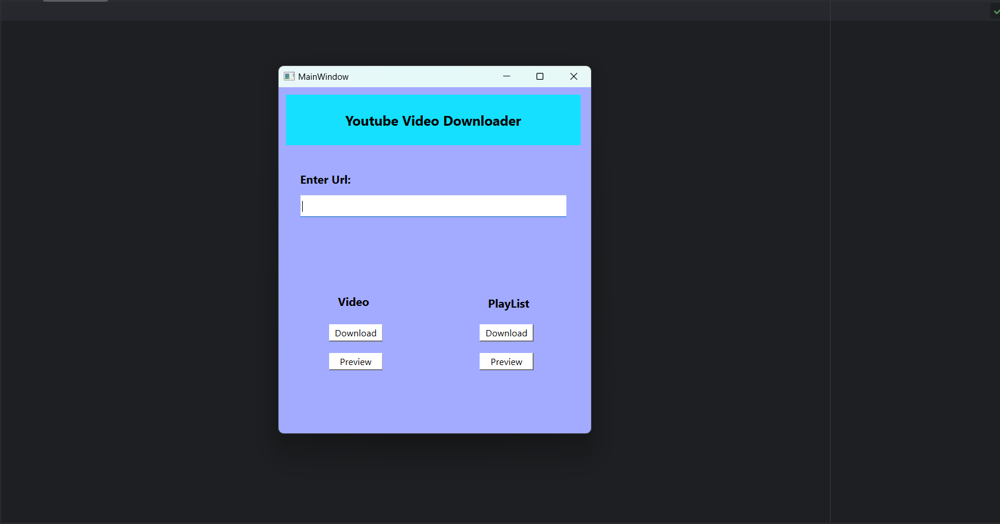

# YouTube-Video/Playlist-Downloader

Python program to download YouTube videos or Playlists by using their respective YouTube urls.

## Requirements

 - Python `3.11` or above
 - Desired IDE (eg:Pycharm, VScode, etc.)
- Main libraries (`PyQt6`, `Pytube`)
- PyQt6 Designer

## Screenshots

## Instructions

- In command prompt
    `pip install pytube` and `pip install PyQt6`
- Download the code file
- Configure the python interpreter and IDE
- Run the `main.py` file in the code
- In the entry box of the window enter a valid youtube video/ playlist url
- Press respective preview/download button for the video or playlist

    
## Note

- `playlist.ui` and `video.ui` are main functionality files for playlists and individual video respectively

- You can change UI by altering `mainwindow.ui` file

- For drag and drop changes to ui use the pyqt designer

